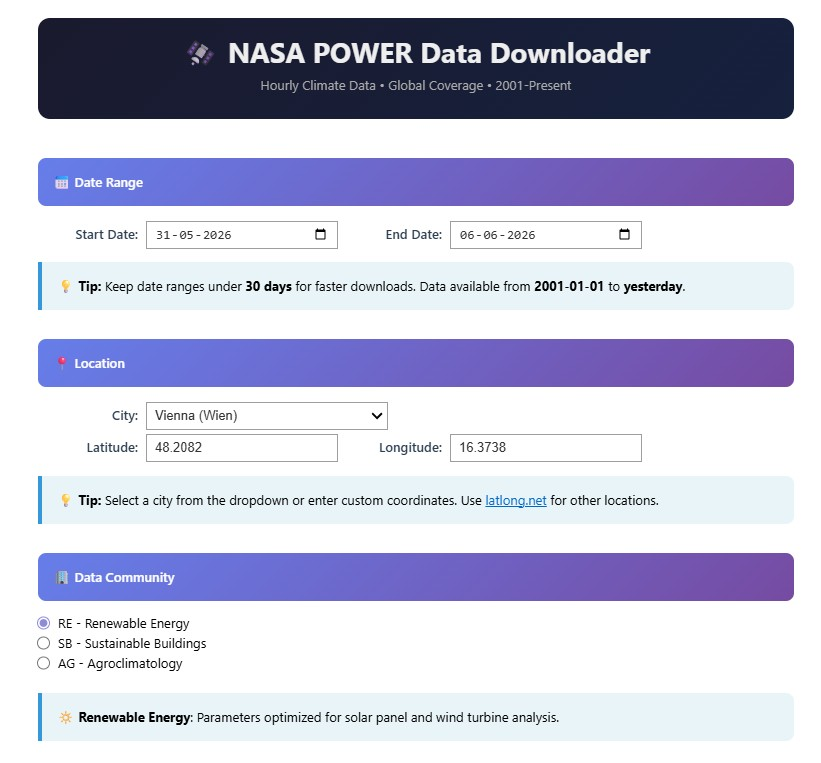
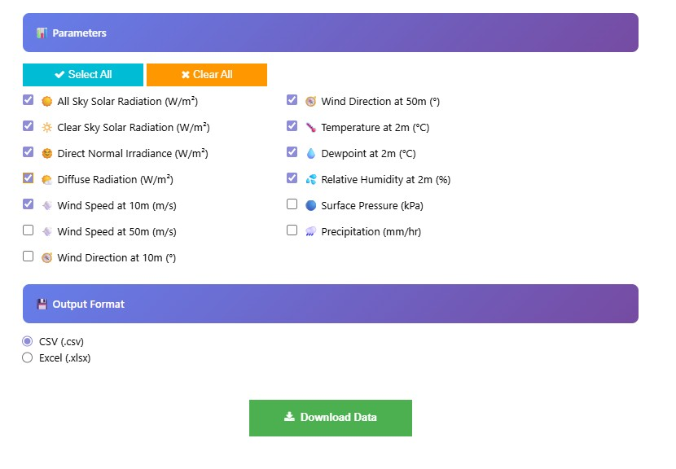
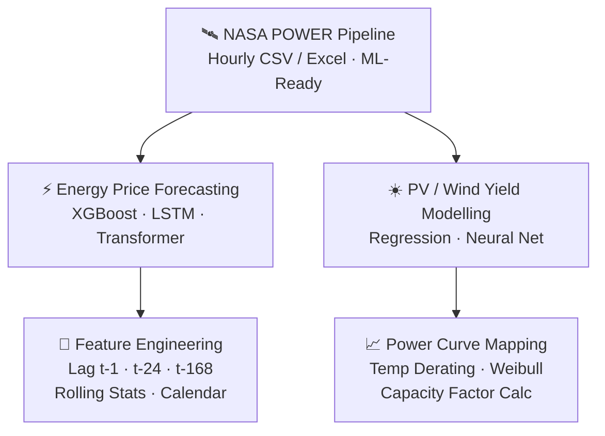

<div align="center">

# 🛰️ NASA POWER Hourly Climate Data Downloader

<p align="center">
  <em>Production-grade climate data pipeline · NASA POWER API · Analysis-ready time-series output</em>
</p>

<p align="center">
  <strong>The NASA POWER portal gives you a file. &nbsp;This pipeline gives you a <em>workflow</em>.</strong>
</p>

<p align="center">
  
  
  
  
</p>

<p align="center">
  
  
  
  
</p>

<br/>

<table align="center">
  <tr>
    <td align="center"><strong>🗓️ Coverage</strong><br/>2001 → Present<br/><sub>Hourly Resolution</sub></td>
    <td align="center"><strong>🌍 Locations</strong><br/>25+ City Presets<br/><sub>+ Custom Lat / Lon</sub></td>
    <td align="center"><strong>📊 Parameters</strong><br/>15 Variables<br/><sub>3 Communities</sub></td>
    <td align="center"><strong>💾 Output</strong><br/>CSV · Excel<br/><sub>ML-Ready Schema</sub></td>
    <td align="center"><strong>🔑 Access</strong><br/>No API Key<br/><sub>Free & Open</sub></td>
  </tr>
</table>

<br/>



</div>

---

## 📌 Overview

> **"NASA POWER already has a download portal — why does this repo exist?"**
>
> Because the portal gives you a raw file. This gives you a **pipeline**.

NASA's web portal at [power.larc.nasa.gov](https://power.larc.nasa.gov/data-access-viewer/) is a point-and-click interface designed for occasional, manual, single-location downloads. It works fine if you need one file once. It breaks down the moment your work becomes systematic, reproducible, or ML-driven.

**This tool was built for exactly the gap the portal leaves open:**

| What You Hit With the Portal | What This Pipeline Delivers |
|---|---|
| Manual clicks — one location at a time | Scriptable, repeatable, automatable |
| Raw `-999` missing-value flags in output | Auto-replaced with `NaN` on ingestion |
| No timestamp index — raw YYYYMMDDHH strings | Parsed `DatetimeIndex` in UTC, sorted |
| You manage format, cleaning, column names | Structured schema, analysis-ready instantly |
| No reproducibility — what did you click last week? | Deterministic file naming encodes every parameter |
| Friction between download and your notebook | One tool, inline in Jupyter, output feeds directly |

This notebook implements a **fully automated, end-to-end climate data pipeline** on top of NASA's POWER REST API — removing every friction point between raw satellite-derived reanalysis data and a clean, ML-ready time-series dataset.

> **Designed for data scientists and ML engineers** who need reproducible, high-quality meteorological features without manual API wrangling.

---

## 🆚 Portal vs. Pipeline — The Real Difference

The NASA POWER Data Access Viewer is a **visualization and exploration tool**.  
This repository is a **data engineering tool**.  
They solve different problems.

### The Manual Portal Workflow (what you avoid)

1. Open browser → navigate to power.larc.nasa.gov
2. Click through date pickers, community selector, parameter checkboxes
3. Enter coordinates manually
4. Submit → wait → download a file
5. Open the file → discover `-999` values scattered through columns
6. Write cleaning code to replace `-999` with `NaN`
7. Parse `YYYYMMDDHH` timestamp column into a real `DatetimeIndex`
8. Rename columns, sort by time, set index
9. Save the cleaned version
10. **Repeat from step 1 for the next location or date range**

**For one location, once: the portal is fine.**  
**For any workflow that is repeated, automated, or ML-driven: it becomes a bottleneck.**

### The Pipeline Workflow (what this repo gives you)

1. Run Cell 1 (once) — dependencies installed
2. Run Cell 2 — interactive UI loads inline in Jupyter
3. Select location, date range, parameters, format
4. Click Download
5. Receive a clean, indexed, NaN-handled, correctly named CSV or Excel file  
   → ready to load directly into pandas, scikit-learn, or any ML framework

### Concrete Scenarios Where the Portal Fails

**Scenario 1 — You're building an energy forecasting model**  
You need 2 years of hourly data for 8 Austrian cities to train your model. With the portal: 8 separate manual sessions, 8 raw files to clean, 8 chances to make an inconsistent choice about parameters or date formats. With this tool: consistent schema, same pipeline, reproducible output every time.

**Scenario 2 — Your colleague needs to reproduce your data**  
With the portal: you hope they clicked exactly what you clicked. With this tool: the filename `NASA_RE_48.2082_16.3738_2026-05-31_2026-06-06.csv` encodes community, coordinates, and date range — unambiguously.

**Scenario 3 — You're automating a recurring data refresh**  
With the portal: not possible without human interaction. With this tool: parameterise the notebook, schedule it, done.

**Scenario 4 — You load the portal's file into pandas**  
First line of actual work: writing `.replace(-999, np.nan)` and `pd.to_datetime(df['YYYYMMDDHH'], format='%Y%m%d%H')`. With this tool: that code is already written, tested, and abstracted away.

---

## 🔬 Why NASA POWER API (Not Just the Website)?

NASA POWER provides **satellite-derived, model-assimilated reanalysis data** at a 0.5° × 0.625° spatial grid — the gold standard for locations with no nearby weather station. Unlike scraping commercial APIs, POWER data is:

- **Free, open, and reproducible** — no API keys, no rate-limit billing surprises
- **Physically consistent** — gap-filled using NASA GEOS-5 model assimilation
- **ML-ready** — continuous hourly records since 2001 with defined missing-value flags (`-999`) auto-converted to `NaN`

**And critically — the REST API unlocks what the portal cannot:**

The NASA POWER REST API is the same data engine that powers the portal's backend. But accessed programmatically, it removes the human-in-the-loop requirement entirely. This repository wraps that API with a validated, structured, reproducible interface — giving you the power of the API with the usability of a guided tool.

> The portal is the **consumer frontend**.  
> This repository is the **engineering backend** — built on the same data, designed for systematic, automated, reproducible use.

---

## ⚙️ Data Pipeline Architecture

```mermaid
flowchart LR
    A["📋 User Input\nDate Range · Lat/Lon\nCommunity · Parameters"]
    -->|HTTPS GET|
    B["🛰️ NASA POWER\nREST API\nTimeout: 180s"]
    -->|Raw JSON|
    C["⚙️ Processing\nJSON → DataFrame\n-999 → NaN\nDatetimeIndex UTC"]
    -->|ML-Ready|
    D["📄 Structured Output\n.csv / .xlsx\nNASA_RE_LAT_LON\n_START_END"]
```

---

## 🚀 Quick Start

### Prerequisites

```bash
pip install jupyter ipywidgets requests pandas openpyxl
```

### Launch

```bash
git clone https://github.com/AIMLDS7/NASA_POWER_Hourly_Climate_Data_Downloader.git
cd NASA_POWER_Hourly_Climate_Data_Downloader
jupyter notebook NASA_POWER_Downloader_R05.ipynb
```

**Cell 1 — Install dependencies** *(run once)*

```python
# Auto-installs: ipywidgets · requests · pandas · openpyxl
```

**Cell 2 — Launch interactive interface** *(configure & download)*

```
▶ Run → interactive UI renders inline
```

---

## 🖥️ Interactive Interface

<div align="center">

</div>

The UI is built with `ipywidgets` and renders fully inside Jupyter. All inputs are validated before the API call is dispatched.

| Section | Options |
|---|---|
| **Date Range** | Any range from 2001-01-01 to yesterday; <30 days recommended |
| **Location** | 25+ city presets (Austria / Germany / Europe) or custom lat/lon |
| **Community** | RE · SB · AG (auto-reorders parameters by domain relevance) |
| **Parameters** | 15 meteorological variables with Select All / Clear All |
| **Output Format** | CSV (`.csv`) or Excel (`.xlsx`) |

---

## 🏢 Data Communities & Domain Mapping

Each NASA POWER community optimises the parameter set for a specific scientific domain:

| Community | Domain | ML / Engineering Applications |
|---|---|---|
| **RE** — Renewable Energy | Solar & wind resource assessment | PV yield modelling, wind power forecasting, grid dispatch optimisation |
| **SB** — Sustainable Buildings | Building thermodynamics | HVAC load prediction, thermal comfort simulation, EnergyPlus inputs |
| **AG** — Agroclimatology | Crop & soil science | Evapotranspiration modelling, irrigation scheduling, yield forecasting |

> Switching communities **automatically reorders** the parameter list by relevance and applies domain-appropriate smart defaults.

---

## 📊 Parameter Reference

| Parameter | Description | Units | Domain Priority |
|---|---|---|---|
| `ALLSKY_SFC_SW_DWN` | All Sky Surface Shortwave Downward Irradiance | W/m² | RE · SB · AG |
| `CLRSKY_SFC_SW_DWN` | Clear Sky Shortwave Downward Irradiance | W/m² | RE · SB |
| `ALLSKY_SFC_SW_DNI` | Direct Normal Irradiance | W/m² | RE |
| `ALLSKY_SFC_SW_DIFF` | Diffuse Horizontal Irradiance | W/m² | RE |
| `WS10M` | Wind Speed at 10 m | m/s | RE · SB · AG |
| `WS50M` | Wind Speed at 50 m | m/s | RE |
| `WD10M` | Wind Direction at 10 m | Degrees | RE · SB |
| `WD50M` | Wind Direction at 50 m | Degrees | RE |
| `T2M` | Air Temperature at 2 m | °C | RE · SB · AG |
| `T2MDEW` | Dew/Frost Point Temperature | °C | RE · SB · AG |
| `T2MWET` | Wet Bulb Temperature | °C | SB · AG |
| `RH2M` | Relative Humidity at 2 m | % | RE · SB · AG |
| `QV2M` | Specific Humidity at 2 m | g/kg | SB · AG |
| `PS` | Surface Pressure | kPa | RE · SB |
| `PRECTOTCORR` | Corrected Total Precipitation | mm/hr | SB · AG |

---

## 📁 Output Schema

Files are auto-named using a deterministic convention for full reproducibility:

```
NASA_{COMMUNITY}_{LATITUDE}_{LONGITUDE}_{START_DATE}_{END_DATE}.csv
```

**Example:**
```
NASA_RE_48.2082_16.3738_2026-05-31_2026-06-06.csv
```

| Column | Type | Description |
|---|---|---|
| `DateTime_UTC` | `DatetimeIndex` | Hourly UTC timestamps (`YYYY-MM-DD HH:MM:SS`) |
| `ALLSKY_SFC_SW_DWN` | `float64` | Solar irradiance — W/m² |
| `WS10M` | `float64` | Wind speed — m/s |
| `T2M` | `float64` | Temperature — °C |
| `...` | `float64` | All selected parameters |

Missing values (`-999`, `-99`) are automatically replaced with `NaN` for clean downstream ingestion into pandas, scikit-learn, or any ML pipeline.

**Sample Output Preview (Vienna · RE Community · 2026-06-01):**
```
DateTime_UTC          ALLSKY_SFC_SW_DWN   T2M    RH2M   WS10M   WD10M
2026-06-01 05:00:00               0.00   14.3    78.2     3.1   245.0
2026-06-01 06:00:00              12.40   14.6    77.5     3.4   241.0
2026-06-01 12:00:00             523.40   22.7    52.1     4.2   198.0
2026-06-01 13:00:00             634.20   23.8    48.6     4.8   205.0
2026-06-01 19:00:00               0.00   19.2    63.4     3.9   220.0
```
*DatetimeIndex in UTC · `-999` flags → `NaN` · Load instantly with `pd.read_csv("NASA_RE_...csv", index_col=0, parse_dates=True)`*

---

## 🧠 Downstream ML Use Cases

This downloader was designed as the **data acquisition layer** for meteorology-driven ML pipelines:



**Directly feeds into:**

- ⚡ [Day-Ahead Energy Price Forecaster (Austria)](https://github.com/AIMLDS7/ML_Dayahead_XGBoost_energy_price_forecaster_Austria) — meteorological features pipeline
- 🌞 Solar PV yield simulation
- 🌬️ Wind resource assessment & turbine siting

---

## 🏙️ Location Presets

25+ pre-loaded cities with validated coordinates:

```
🇦🇹 AUSTRIA              🇩🇪 GERMANY               🌍 EUROPE & BEYOND
────────────────────    ─────────────────────    ──────────────────────
Vienna (Wien)           Berlin                   London, UK
Graz                    Munich (München)         Paris, France
Linz                    Hamburg                  Zurich, Switzerland
Salzburg                Frankfurt am Main        Amsterdam, Netherlands
Innsbruck               Cologne (Köln)           Rome, Italy
Klagenfurt              Stuttgart                Madrid, Spain
Villach                 Düsseldorf               New York, USA
Wels                    Leipzig
St. Pölten              Dresden
Dornbirn                Hannover · Dortmund...
```

For any other location → [latlong.net](https://www.latlong.net/)

---

## 📦 Dependencies

| Package | Role |
|---|---|
| `ipywidgets ≥ 7.6` | Interactive UI — date pickers, dropdowns, checkboxes |
| `requests ≥ 2.25` | HTTP client for NASA POWER REST API |
| `pandas ≥ 1.3` | Data ingestion, timestamp parsing, NaN handling, export |
| `openpyxl ≥ 3.0` | Excel `.xlsx` serialisation |

---

## 📂 Repository Structure

```
📦 NASA_POWER_Hourly_Climate_Data_Downloader/
├── 📓 NASA_POWER_Downloader_R05.ipynb   ← Pipeline notebook (2 cells)
├── 📁 images/                           ← README screenshots
│   ├── NASA_POWER_Data_Downloader.jpg
│   ├── parameters.jpg
├── 📄 README.md
└── 📄 LICENSE
```

---

## ⚠️ Troubleshooting

| Error | Cause | Fix |
|---|---|---|
| `422 Unprocessable Entity` | Coordinates over ocean | Use a land location |
| `422 Unprocessable Entity` | Too many parameters | Select ≤ 8 parameters |
| `422 Unprocessable Entity` | Date range too long | Start with 7–14 days |
| `Timeout` | NASA server congestion | Retry during European morning hours |
| `KeyError: properties` | Unexpected API response format | Reduce parameters or retry |

---

## 🔗 Resources

- [NASA POWER Data Access Viewer](https://power.larc.nasa.gov/data-access-viewer/)
- [NASA POWER Parameter Dictionary](https://power.larc.nasa.gov/docs/tutorials/parameters/)
- [NASA POWER API Documentation](https://power.larc.nasa.gov/docs/services/api/)
- [GEOS-5 Reanalysis System](https://gmao.gsfc.nasa.gov/GEOS_systems/)

---

## 📜 License

Distributed under the MIT License. See [`LICENSE`](LICENSE) for details.

---

<div align="center">

**Built by [AIMLDS7](https://github.com/AIMLDS7)**

*Part of an end-to-end energy analytics & ML portfolio*

`NASA POWER API` · `Pandas` · `ipywidgets` · `Jupyter`

</div>
